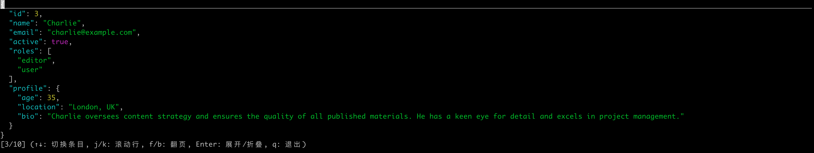

# JSON Lines Viewer

A lightweight, interactive TUI (Text User Interface) viewer for JSON Lines (.jsonl) files with syntax highlighting and folding capabilities.



## Features

- 🚀 Fast and lightweight JSON Lines file viewer
- 🎨 Syntax highlighting for different JSON elements
- 📂 Collapsible JSON structures
- ⌨️ Vim-style navigation
- ↔️ Horizontal and vertical scrolling
- 🖥️ Full-screen terminal interface
- 🔍 Easy navigation between JSON records

## Installation

```bash
# Clone the repository
git clone https://github.com/guru4elephant/json-viewer.git
cd json-viewer

# Install dependencies
pip install -r requirements.txt
python3 setup.py install
```

## Dependencies

- click
- prompt_toolkit

## Usage

```bash
jv sample.jsonl
```

### Key Bindings

| Key | Action |
|-----|--------|
| `↑`/`↓` | Navigate between JSON records |
| `j`/`k` | Scroll up/down one line |
| `f`/`b` | Page down/up |
| `PageUp`/`PageDown` | Scroll page up/down |
| `Ctrl+F`/`Ctrl+B` | Alternative page up/down |
| `←`/`→` | Scroll horizontally |
| `Enter` | Toggle fold/unfold JSON structure |
| `q` | Quit the viewer |

### Color Scheme

- 🔵 Cyan: Keys
- 🟢 Green: Strings
- 🟡 Yellow: Numbers
- 🟣 Purple: Boolean values
- 🔴 Red: Null values
- ⚪ White: Braces and commas

## Contributing

Contributions are welcome! Please feel free to submit a Pull Request.

1. Fork the repository
2. Create your feature branch (`git checkout -b feature/AmazingFeature`)
3. Commit your changes (`git commit -m 'Add some AmazingFeature'`)
4. Push to the branch (`git push origin feature/AmazingFeature`)
5. Open a Pull Request

## License

This project is licensed under the MIT License - see the [LICENSE](LICENSE) file for details.

## Acknowledgments

- Built with [prompt_toolkit](https://github.com/prompt-toolkit/python-prompt-toolkit)
- Inspired by the need for a simple, efficient JSONL file viewer

## Author

Dongdaxiang - [@guru4elephant](https://github.com/guru4elephant)

## Support

If you found this project helpful, please give it a ⭐️!

